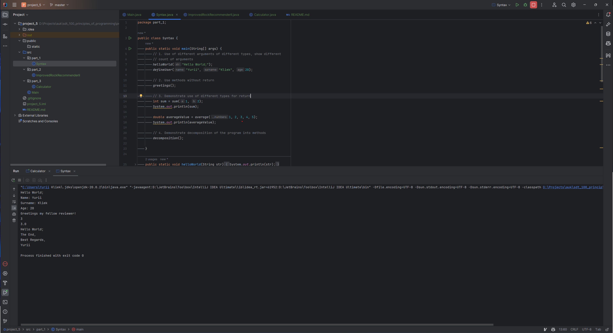
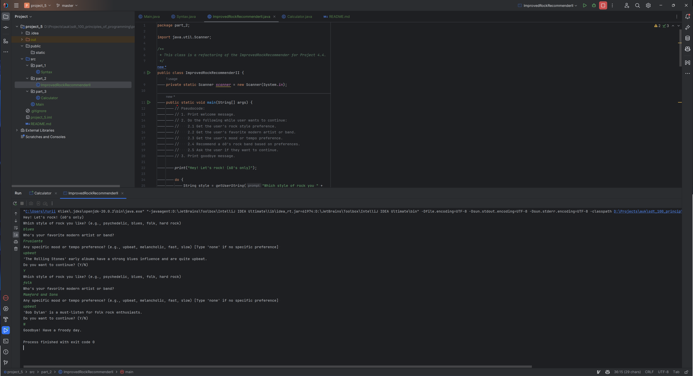
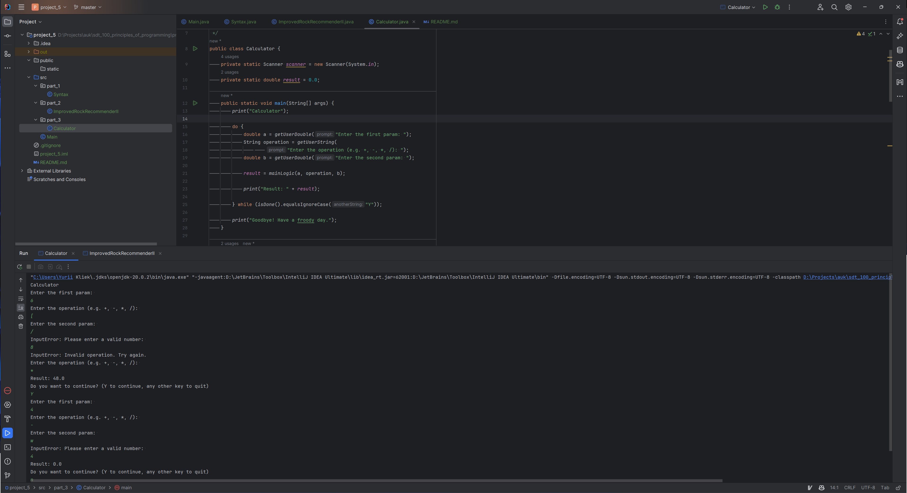

# UK SDT 100: Principles of Programming FA23: Project 5. Methods & arguments

A series of Java projects demonstrating various programming techniques and best practices.

## Table of Contents

- [File Structure](#file-structure)
- [Part 1: Syntax](#part-1-syntax)
- [Part 2: Improved Rock Recommender II](#part-2-improved-rock-recommender-ii)
- [Part 3: Calculator](#part-3-calculator)

## File Structure

<pre>
project_5
│
├── public
│   └── static
│       └── [screenshots]
│
├── src
│   ├── part_1
│   │   └── Syntax.java
│   │
│   ├── part_2
│   │   └── ImprovedRockRecommenderII.java
│   │
│   └── part_3
│       └── Calculator.java
│
├── .gitignore
├── README.md
└── project_5.iml
</pre>

## Part 1: Syntax

This part focuses on the demonstration of methods with various access types, arguments, return values, and decomposition.

## Part 2: Improved Rock Recommender II

This part aims to refactor and improve the `ImprovedRockRecommender` program by decomposing it into methods. The program provides rock music suggestions based on user input.

## Part 3: Calculator

An optional project providing a simple calculator functionality. Users can perform basic arithmetic operations and continue operations with the previous result.

